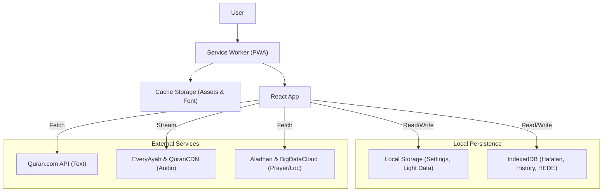

# Application Logic Flow (NIZAMY)

Dokumen ini menjelaskan alur data dan logika bisnis dari setiap modul dalam aplikasi NIZAMY versi terbaru.

---

## 1. Global Architecture Flow

---

## 2. Mushaf Digital Flow

Modul ini menangani rendering Al-Quran dengan performa tinggi dan fitur interaktif.

1.  **Data Fetching:**
    - Menggunakan `useMushafData` hook.
    - Fetch ayat per *chunk* (pagination) dari API untuk menghindari *blocking* UI.
    - Data ayat (teks, terjemahan, info kata) disimpan dalam state lokal komponen.
2.  **Rendering (Virtualization):**
    - Menggunakan `react-virtuoso` untuk me-render hanya ayat yang terlihat di layar.
    - Ini memungkinkan scrolling ribuan ayat tanpa lag.
3.  **Tajwid Analysis:**
    - `tajwid.helper.ts` memindai teks Arab menggunakan Regex.
    - Menerapkan *Rule-based coloring* (misal: Nun Mati bertemu Ba = Iqlab/Biru).
    - Menangani aturan antar-kata (bila kata A berakhir sukun, kata B mulai huruf tertentu).
4.  **Audio Playback:**
    - `useMushafAudio` mengelola elemen HTML5 Audio tunggal.
    - Mendukung mode **Ayah Playback** (urutan ayat) dan **Word Playback** (klik per kata).
    - Sinkronisasi highlight teks saat audio berjalan.

---

## 3. H.E.D.E (Halal Economic Diagnostic Engine) Flow

Alur diagnosa mandiri ekonomi syariah.

1.  **Wizard Input:**
    - User menjawab pertanyaan bertahap.
    - **Dependency Logic:** Pertanyaan tertentu hanya muncul jika jawaban sebelumnya relevan (misal: Pertanyaan "Sumber Modal Bisnis" hanya muncul jika user menjawab "Punya Bisnis").
2.  **Risk Calculation:**
    - Setiap jawaban memiliki bobot risiko (0-100) dan tipe pelanggaran (Riba, Gharar, Maysir, Zulm).
    - **Poison Logic:** Jika ada *satu* pelanggaran kritis (skor risiko >= 80, misal Riba), skor total kepatuhan dibatasi maksimal 40, meskipun aspek lain sempurna.
3.  **Result Generation:**
    - Menghasilkan **Skor Total**, **Level Risiko** (Aman/Syubhat/Kritis), dan **Roadmap**.
    - Roadmap dipilih berdasarkan matriks: Tingkat Risiko vs Tingkat Kedaruratan Ekonomi (Hardship).
    - Jika Darurat Tinggi -> Roadmap *Tadarruj* (Bertahap).
    - Jika Darurat Rendah -> Roadmap *Bara'ah* (Segera).
4.  **Output:**
    - Visualisasi Grafik Radar & Gauge.
    - PDF Report Generator.

---

## 4. Hafalan Quran Tracker (SRS) Flow

Logika pelacakan hafalan dengan gamifikasi.

1.  **Input:** User memilih surat dan rentang ayat.
2.  **Validation:**
    - Cek kuota harian (berdasarkan level kesulitan user: Beginner/Intermediate/Advanced).
    - Menghitung "Bobot Beban" (ayat panjang nilainya lebih besar).
3.  **Review Session (SRS):**
    - User melakukan setoran/murajaah.
    - Input: Lancar / Lupa.
    - **Algorithm:**
        - Lancar: Stage naik (+1), Interval review memanjang (besok -> 3 hari -> 7 hari -> dst).
        - Lupa: Stage reset ke 1, Interval review jadi 1 hari (besok).
4.  **Gamification:**
    - Menghitung XP dan Streak harian.
    - Cek *Badge Unlock* (misal: "Streak 7 Hari", "Juz 30 Selesai").

---

## 5. Faraidh & Zakat Flow

Logika kalkulator fikih.

1.  **Input:** User memasukkan data harta dan keluarga.
2.  **Processing (Service Layer):**
    - **Faraidh:** Deteksi *Hajb* (penghalang) -> Hitung Furudh (Bagian Pasti) -> Distribusi Ashabah (Sisa) -> Koreksi 'Aul/Radd.
    - **Zakat:** Cek *Nisab* (Ambang Batas) -> Jika melebihi -> Hitung 2.5% (atau tarif lain sesuai jenis).
3.  **Persistence:** Menyimpan riwayat perhitungan ke `localStorage` untuk akses cepat.
4.  **Export:** Menggunakan `html2canvas` dan `jspdf` untuk membuat laporan PDF dari hasil.

---

## 6. Data Management Flow

Fitur Backup & Restore.

1.  **Export:**
    - Mengumpulkan data dari `localStorage` (Setting, History ringan).
    - Mengumpulkan data dari `IndexedDB` (Database Hafalan User, HEDE).
    - Membungkus menjadi satu file JSON.
2.  **Import:**
    - Validasi struktur file JSON.
    - *Clear* database saat ini.
    - Menulis ulang data ke `localStorage` dan `IndexedDB` sesuai kuncinya.
    - Reload aplikasi untuk menerapkan state baru.
