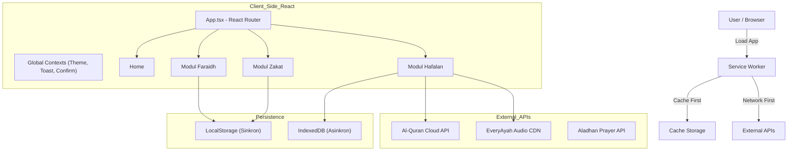
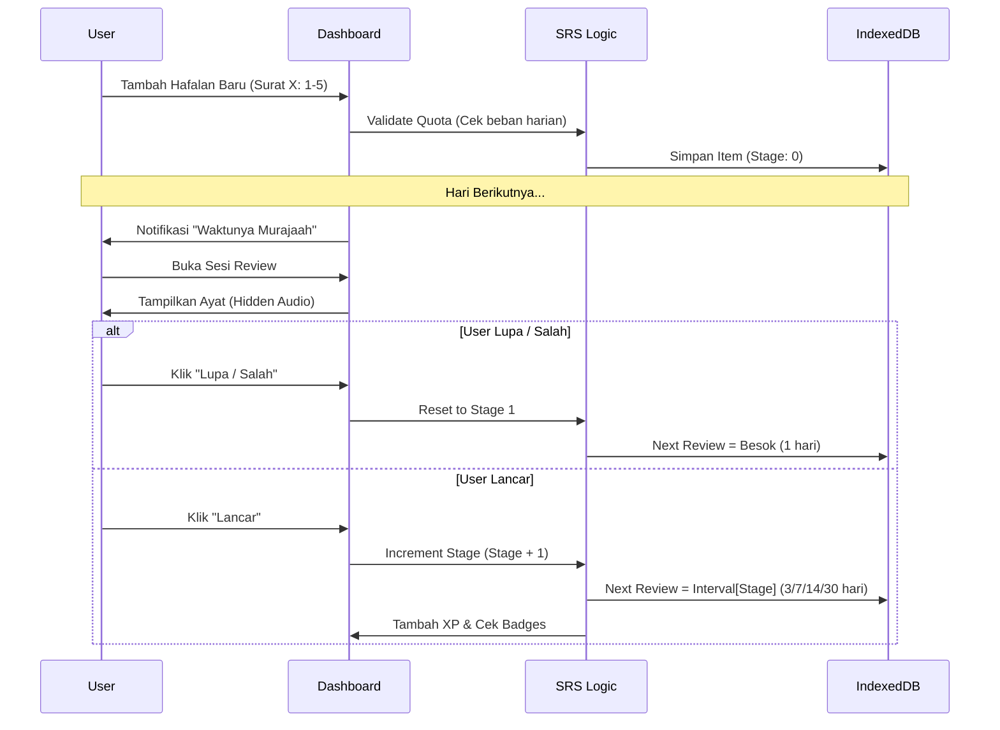

# Application Logic Flow (NIZAMY)

Dokumen ini menjelaskan alur data dan logika bisnis dari setiap modul dalam aplikasi NIZAMY.

---

## 1. Global Architecture Flow

**Catatan Arsitektur:** Aplikasi menggunakan strategi penyimpanan *hybrid*. Data berat yang tidak memerlukan akses sinkron (seperti data Hafalan) disimpan di **IndexedDB** untuk skalabilitas. Data ringan yang dibutuhkan UI secara langsung saat render (seperti riwayat Zakat & Waris) disimpan di **LocalStorage**.

---

## 2. Faraidh Calculator Flow (Waris)

Alur perhitungan pembagian waris. Logika ini sangat ketat mengikuti aturan fiqh.

1.  **Input Data:** User memasukkan jumlah ahli waris yang ada & total harta.
2.  **Filtering (Hajb):** Sistem mengeliminasi ahli waris yang terhalang (_Mahjub_) oleh ahli waris lain yang lebih dekat.
    - _Contoh:_ Cucu laki-laki terhalang jika ada Anak laki-laki.
3.  **Penentuan Bagian (Furudh):** Memberikan nilai pecahan (1/2, 1/4, 1/8, dll) kepada _Ashabul Furudh_.
4.  **Kalkulasi KPK (Asal Masalah):** Mencari penyebut persekutuan terkecil dari semua pecahan.
5.  **Distribusi Sisa (Ashabah):** Jika ada sisa harta, diberikan ke ahli waris _Ashabah_.
6.  **Koreksi Kasus Khusus:**
    - **'Aul:** Total saham > Asal Masalah -> Naikkan Asal Masalah.
    - **Radd:** Total saham < Asal Masalah (Tanpa Ashabah) -> Kembalikan sisa ke Furudh.
7.  **Output:** Tampilkan hasil persentase, nilai nominal, dan dalil.

---

## 3. Zakat Calculator Flow

Alur kalkulasi multi-tab menggunakan `useReducer`.

1.  **Select Type:** User memilih Tab (Fitrah / Maal / Emas / Tani / dll).
2.  **Input & Settings:**
    - User input nilai aset.
    - User dapat mengubah asumsi harga emas/beras di "Settings".
3.  **Threshold Check (Nisab):**
    - Total Aset Bersih = (Aset - Hutang Jatuh Tempo).
    - Cek: `Total Aset >= Harga Emas 85g` (untuk Maal/Niaga).
4.  **Calculation:**
    - Jika `>= Nisab`: `Total * 2.5%`.
    - Jika `< Nisab`: 0 (Tidak wajib).
5.  **Aggregation:** Tab "Ringkasan" menjumlahkan seluruh zakat yang wajib dibayar.

---

## 4. Hafalan Quran Tracker Flow (SRS Logic)

Ini adalah modul paling kompleks dengan logika _state machine_.

### A. User Journey

### B. Aturan Gamifikasi

1.  **XP Calculation:**
    - Item Baru: `10 XP * Bobot Ayat` (Ayat panjang bobotnya lebih besar).
    - Review Lancar: `5 XP * Bobot Ayat`.
    - Review Gagal: `1 XP * Bobot Ayat`.
2.  **Streak:** Reset ke 0 jika user tidak login/buka app > 24 jam dari tanggal terakhir.
3.  **Badges:** Diberikan saat kondisi tertentu terpenuhi (misal: 7 hari streak, hafal Juz 30).

---

## 5. Audio Service Flow

Untuk menghindari masalah performa dan _Auto-play policy_ browser.

1.  **Inisialisasi:** `AudioContext` dibuat dalam mode _Suspended_.
2.  **User Interaction:** Saat user klik tombol pertama kali, `AudioContext` di-_resume_.
3.  **Synthesizer (SFX):** Menggunakan Oscillator node untuk suara 'Ting' (Sukses) atau 'Buzz' (Gagal). Ringan, tanpa download file mp3.
4.  **Quran Player:** Menggunakan HTML5 `<audio>` standar yang mengambil sumber dari CDN `everyayah.com`.